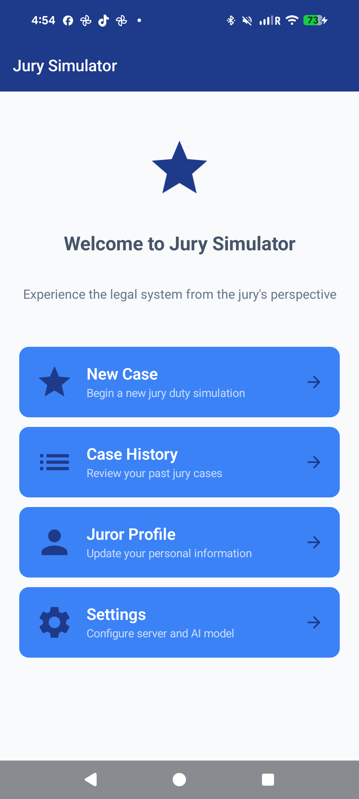
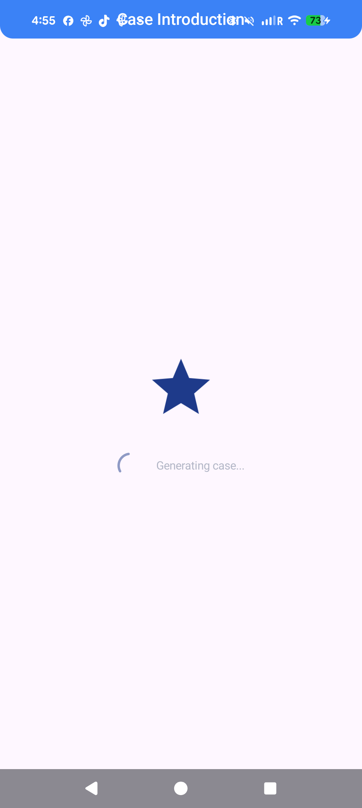
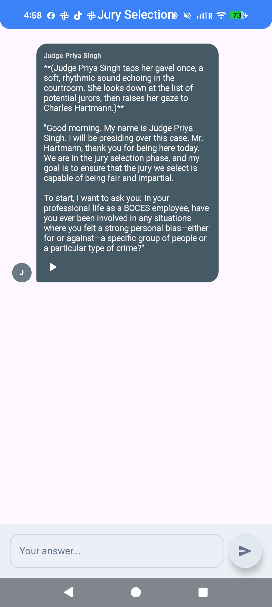
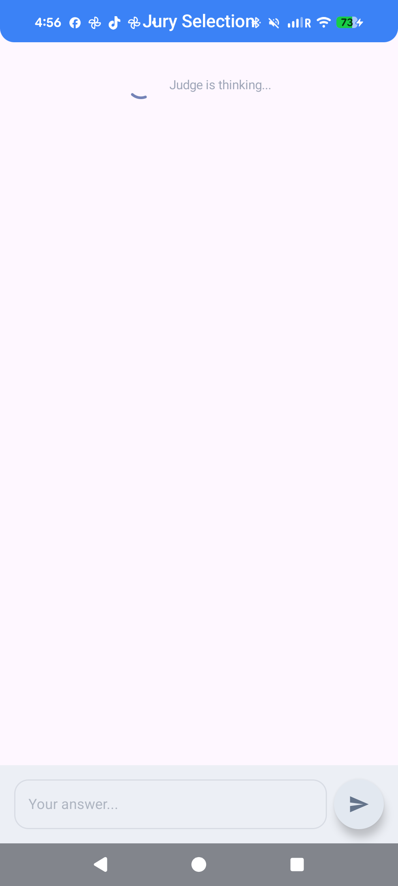
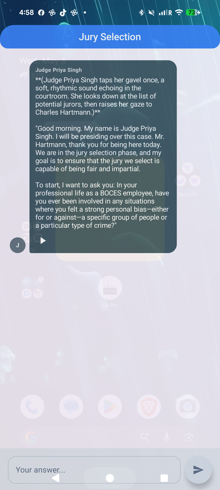
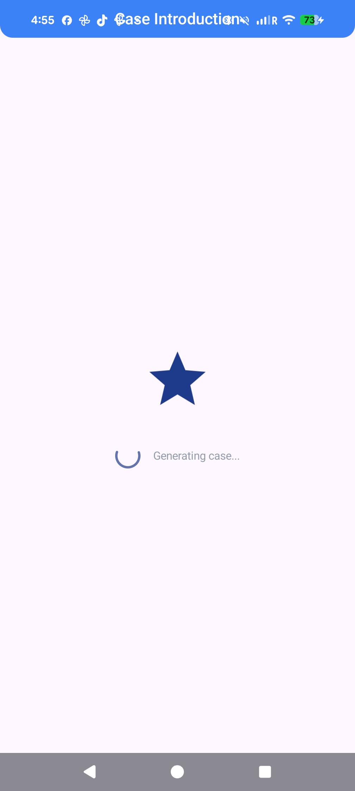

# Jury Simulator

**Decide justice from your phone.**

Step into the jury box for AI-generated criminal trials. Voir dire, witnesses, evidence, deliberation, verdict — the whole process, every time.

[Website](https://chartmann1590.github.io/jury-simulator/) · [Download APK](https://github.com/chartmann1590/jury-simulator/releases/latest) · [Privacy](https://chartmann1590.github.io/jury-simulator/privacy.html) · [Support](https://chartmann1590.github.io/jury-simulator/support.html)

---

## What it is

Jury Simulator is a free Android app that puts you in the jury box for AI-generated trials. You'll move through voir dire, sit through witness testimony, weigh the evidence, deliberate with eleven AI jurors, and cast the vote that decides the case.

Every case is generated fresh — different defendant, different charges, different witnesses — so no two sessions play out the same way. The AI runs **on your device**: after a one-time model download, every trial is generated locally. Your notes and votes never leave your phone.

There's no account, no email, no paywall. A small banner ad and an occasional interstitial keep the lights on.

## What's in the courtroom

- **The full trial flow** — voir dire, opening statements, witnesses, evidence, closing arguments, deliberation, verdict. Nothing skipped.
- **Eleven AI jurors with hidden biases** — every juror has a profession, a personality, and a private leaning. Some you can sway. Some you can't.
- **Private one-on-ones** — talk to the room or pull a single juror aside in chambers before the next vote.
- **Up to five rounds of voting** — unanimous or you hang the jury.
- **A notebook that earns its keep** — track contradictions, evidence, and witness inconsistencies as the trial unfolds.
- **Case history** — revisit decisions you regret.
- **Customizable juror profile.**

## Screenshots

## Get the app

| Source | Status |
|---|---|
| [GitHub Releases](https://github.com/chartmann1590/jury-simulator/releases/latest) — direct APK | ✅ Available |
| Google Play Store | 🚧 Coming soon |

Android 8.0 (Oreo) or newer. About 4 GB of storage after the one-time model download.

## What we don't collect

- No analytics. No Firebase, no Crashlytics, no third-party trackers.
- No account system. We don't ask for an email.
- No cloud storage of your gameplay — there's no server to leak.

The full privacy policy is at [chartmann1590.github.io/jury-simulator/privacy.html](https://chartmann1590.github.io/jury-simulator/privacy.html).

## License

MIT. See [LICENSE](LICENSE).

---

## For developers

Open-source under MIT. Pull requests welcome.

- **Tech**: Kotlin · Jetpack Compose · Material 3 · LiteRT-LM (on-device inference) · Room · DataStore · Google Mobile Ads
- **Min SDK**: 26 (Android 8.0) · **Target SDK**: 35
- **Build**: `./gradlew assembleDebug` after adding `local.properties` (see `keystore.properties.example` for shape; the AdMob keys go in `local.properties`)
- **Architecture overview**: [`docs/architecture.md`](docs/architecture.md)
- **Trial flow internals**: [`docs/trial_flow.md`](docs/trial_flow.md)
- **AI integration**: [`docs/ai_integration.md`](docs/ai_integration.md)
- **All developer docs**: [`docs/`](docs/)
- **Contributing**: [CONTRIBUTING.md](CONTRIBUTING.md)
- **Security disclosures**: [SECURITY.md](SECURITY.md)
- **Project agent guide for Claude**: [CLAUDE.md](CLAUDE.md)

CI on every push runs lint and unit tests; pushes to `master` build a signed AAB + APK and publish a GitHub Release. See [`.github/workflows/`](.github/workflows/).

---

© 2026 Charles Hartmann · MIT-licensed app · <a href="https://chartmann1590.github.io/jury-simulator/">jury-simulator</a>

